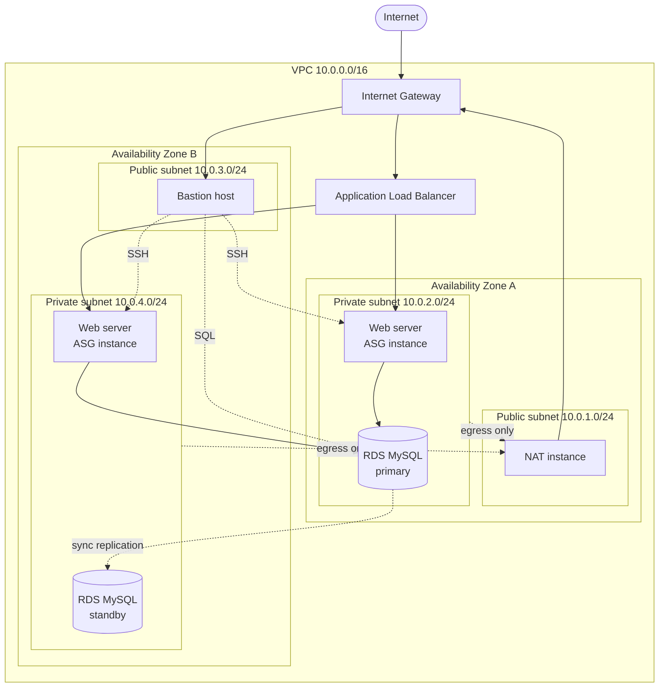

# Network diagram — F-1-A / I-1-A combined HA architecture

This is the diagram required by F-1-B/F-1-I/F-1-A (rendered with Mermaid — a diagramming tool, satisfying the "tool of your choice" requirement). It also doubles as the architecture reference for the I-1-A technical discussion.

**Minimum F elements present:**
- VPC with ≥2 subnets, 1 public + 1 private → here, 2 public + 2 private across 2 AZs
- Internet Gateway for public access
- NAT instance in the public subnet for private-subnet egress (chosen over a managed NAT Gateway to save Academy lab budget)
- Web server (public-facing via ALB) and database server (private, internal only)
- Security groups scoping traffic per tier (see `security-groups.tf`)
- CIDR blocks: VPC `10.0.0.0/16`, public `10.0.1.0/24` / `10.0.3.0/24`, private `10.0.2.0/24` / `10.0.4.0/24`

**Optional F extensions implemented:** Load balancer (ALB) ✅, Bastion host ✅. VPN — not implemented (out of scope/no second network to connect to).

**HA/scalability elements added for F-1-A / I-1-A:**
- 2 AZs instead of 1 for every tier
- Auto Scaling Group (min 2, max 4, desired 2) instead of a single fixed web server
- RDS Multi-AZ instead of a single DB instance — synchronous standby in the second AZ, automatic failover
